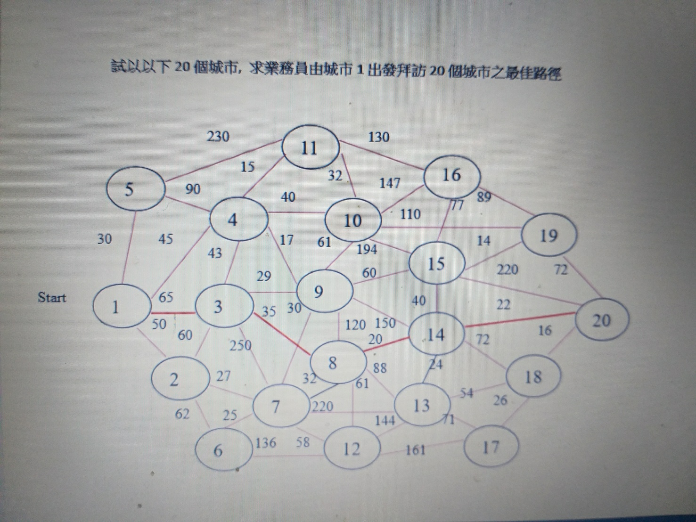
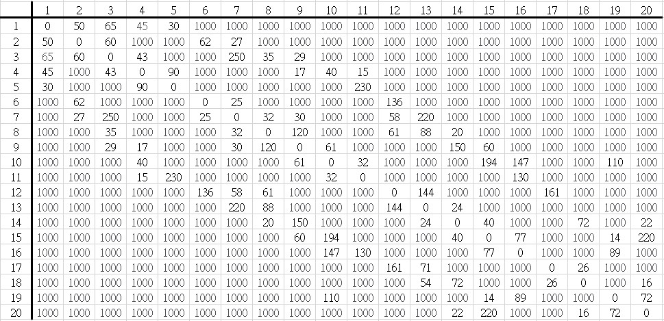
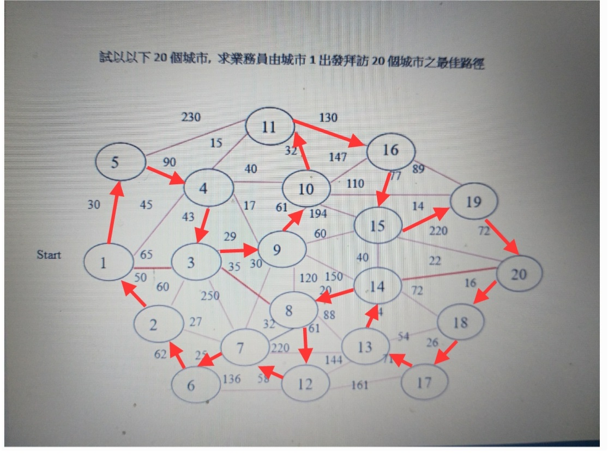

# TSP(旅行推銷員問題)
今天有兩位推銷員來，老闆給他們一個考驗，誰可以拜訪所有城市，且花的旅程是最短的就可以勝任這次的業務。

    任務:
	    給定一系列城市和每對城市之間的距離，求解一座城市並回到起始城市的最短路徑

# 城市

# 測資

 - 第一行:城市數量
 - 第二行:開始點
 - 剩下城市之間距離如下說明
 >先使用EXCEL進行資料輸入50
  例如:2->1距離為50，請在2-1中輸入50，因為本範例是無向圖，因此1->2也是50。
  若城市與城市間無法直接到達，請輸入1000

>完成後將EXCEL轉換成CSV，在使用記事本開啟並將外框節點的數字刪除。
將第一行及第二行資料進行輸入，如下圖

# 計算結果

# 示範

